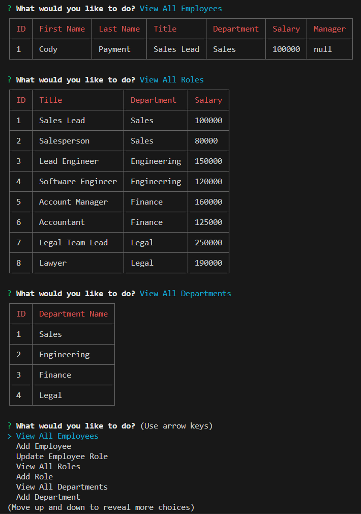

# Employee-Tracking

## Description
Employee Tracking is an interface designed to help the user keep track of their employees, roles, and departments as well as create and assign new employees to roles and departments.

## Link to Video Walkthrough
[Video Walkthrough](https://drive.google.com/file/d/1raFznC1KHH24gu7I_CKWU49yk2Le5Mzt/view)